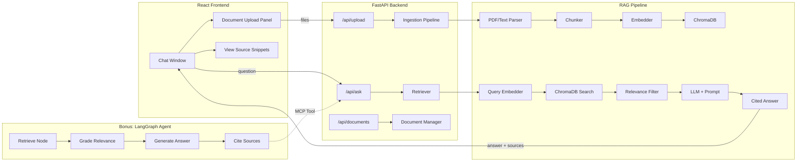
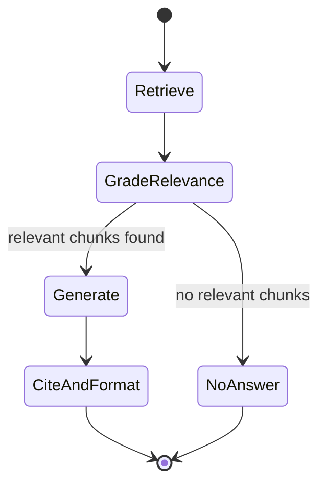

# 🧠 Intelligent Enterprise Knowledge Assistant — Implementation Plan

> **RAG-Based Document Q&A** | IEM × TCS Hackathon

---

## Tech Stack Summary

| Layer | Technology |
|---|---|
| **LLM** | Ollama (local) — `llama3.1` or `mistral` |
| **Embeddings** | `sentence-transformers` (`all-MiniLM-L6-v2`) |
| **Vector Store** | ChromaDB (persistent, local) |
| **Backend** | FastAPI (Python) |
| **Frontend** | React (Vite) + Vanilla CSS |
| **Agent Framework** | LangGraph (bonus) |
| **MCP Server** | FastMCP (bonus) |

---

## Architecture Overview



---

## Phase 1 — Project Setup & Sample Data

**Goal:** Scaffold the project and prepare 5–10 sample documents.

### Tasks

1. **Initialize project structure:**
   ```
   IEMxTCS Hackathon/
   ├── backend/
   │   ├── app/
   │   │   ├── main.py              # FastAPI entry point
   │   │   ├── config.py            # Settings & constants
   │   │   ├── routers/
   │   │   │   ├── ask.py           # /api/ask endpoint
   │   │   │   ├── upload.py        # /api/upload endpoint
   │   │   │   └── documents.py     # /api/documents endpoint
   │   │   ├── services/
   │   │   │   ├── ingestion.py     # Document parsing + chunking
   │   │   │   ├── retriever.py     # Vector search + relevance
   │   │   │   ├── llm.py           # Ollama interaction
   │   │   │   └── vectorstore.py   # ChromaDB wrapper
   │   │   └── models/
   │   │       └── schemas.py       # Pydantic models
   │   ├── data/
   │   │   └── sample_docs/         # 5-10 sample PDFs/text files
   │   ├── chroma_db/               # Persisted vector store
   │   ├── requirements.txt
   │   └── .env
   ├── frontend/
   │   ├── src/
   │   │   ├── App.jsx
   │   │   ├── App.css
   │   │   ├── components/
   │   │   │   ├── ChatWindow.jsx
   │   │   │   ├── MessageBubble.jsx
   │   │   │   ├── SourceSnippet.jsx
   │   │   │   ├── DocumentUpload.jsx
   │   │   │   └── Sidebar.jsx
   │   │   └── main.jsx
   │   ├── index.html
   │   ├── package.json
   │   └── vite.config.js
   └── README.md
   ```

2. **Create sample documents** (synthetic/fictional):
   - `HR_Policy.pdf` — Leave policies, attendance rules
   - `IT_Security_Policy.pdf` — Password, VPN, data handling
   - `Employee_Handbook.pdf` — Onboarding, code of conduct
   - `Travel_Reimbursement_FAQ.txt` — Expense guidelines
   - `Remote_Work_Policy.pdf` — WFH eligibility, expectations
   - (Optionally 3–4 more)

3. **Install Ollama** and pull the model (`ollama pull llama3.1` or `mistral`)

> [!IMPORTANT]
> All documents must be public, synthetic, or anonymized — no real user data.

---

## Phase 2 — Document Ingestion Pipeline

**Goal:** Parse documents → chunk → embed → store in ChromaDB.

### Tasks

1. **`ingestion.py` — Document Parser:**
   - Use `PyPDF2` or `pdfplumber` to extract text from PDFs
   - Support plain `.txt` and `.md` files
   - Store original filename + section metadata with each chunk

2. **`ingestion.py` — Chunker:**
   - Use `RecursiveCharacterTextSplitter` from LangChain
   - **Chunk size:** ~500 tokens, **overlap:** ~50 tokens
   - Attach metadata: `{ source: "HR_Policy.pdf", chunk_index: 3, section: "4.2" }`

3. **`vectorstore.py` — Embedding & Storage:**
   - Load `all-MiniLM-L6-v2` via `sentence-transformers`
   - Create a persistent ChromaDB collection
   - Embed chunks and upsert with metadata

4. **`/api/upload` endpoint:**
   - Accept multipart file uploads (PDF, TXT, MD)
   - Run the ingestion pipeline
   - Return status + number of chunks created

### Key Design Decisions
- Chunk size of ~500 tokens balances context richness vs. precision
- Metadata tracking enables the "View Source" feature later
- Persistent ChromaDB avoids re-indexing on restart

---

## Phase 3 — Retrieval & Answer Generation

**Goal:** Query the vector store → filter by relevance → generate a cited answer.

### Tasks

1. **`retriever.py` — Vector Search:**
   - Embed the user query with the same model
   - Query ChromaDB for top-k (k=5) most similar chunks
   - Return chunks with similarity scores + metadata

2. **`retriever.py` — Relevance Filter:**
   - Set a similarity threshold (e.g., score ≥ 0.35)
   - If **no chunks pass** the threshold → return "I couldn't find this in the available documents"
   - If chunks pass → forward to LLM

3. **`llm.py` — Ollama Integration:**
   - Use `ollama` Python library or direct HTTP calls to `localhost:11434`
   - Craft a system prompt enforcing grounded answers:
     ```
     You are a knowledge assistant. Answer ONLY using the provided context.
     If the context doesn't contain the answer, say "I couldn't find this
     in the available documents." Always cite the source document and section.
     ```
   - Pass retrieved chunks as context in the user prompt

4. **`/api/ask` endpoint:**
   - Accept: `{ "question": "..." }`
   - Return:
     ```json
     {
       "answer": "Employees get 12 casual leaves per year.",
       "sources": [
         { "document": "HR_Policy.pdf", "section": "4.2", "snippet": "..." }
       ],
       "confidence": 0.87
     }
     ```

### Edge Cases Handled
| Scenario | Behavior |
|---|---|
| No matching document | Reply: "I couldn't find this in the available documents" |
| Empty question | Return 400 with prompt to type a question |
| Ambiguous query (e.g., "leave?") | LLM asks one clarifying question before answering |
| Multiple relevant docs | Cite all sources in the answer |

---

## Phase 4 — React Frontend

**Goal:** Build a polished chat UI with document upload and source citations.

### Layout
```
┌──────────────────────────────────────────────────┐
│  📚 Knowledge Assistant                    [⚙️]  │
├────────────┬─────────────────────────────────────┤
│            │                                     │
│  Document  │        Chat Window                  │
│  Upload    │                                     │
│  Panel     │  ┌─────────────────────────────┐    │
│            │  │ 🧑 How many casual leaves?  │    │
│  ┌──────┐  │  └─────────────────────────────┘    │
│  │ 📄   │  │  ┌─────────────────────────────┐    │
│  │ Drop │  │  │ 🤖 Employees get 12 casual  │    │
│  │ here │  │  │    leaves per year.          │    │
│  └──────┘  │  │                              │    │
│            │  │ 📎 Source: HR_Policy.pdf §4.2│    │
│  Uploaded: │  │ ▶ View Source Snippet         │    │
│  • HR.pdf  │  └─────────────────────────────┘    │
│  • IT.pdf  │                                     │
│            │  ┌──────────────────────┐            │
│            │  │ Ask a question...    │  [Send]    │
│            │  └──────────────────────┘            │
├────────────┴─────────────────────────────────────┤
│  Powered by Ollama + ChromaDB                    │
└──────────────────────────────────────────────────┘
```

### Components
1. **`ChatWindow.jsx`** — Message list + input bar, auto-scroll, loading indicator
2. **`MessageBubble.jsx`** — User/bot message styling, supports markdown rendering
3. **`SourceSnippet.jsx`** — Expandable accordion showing source document, section, and raw text
4. **`DocumentUpload.jsx`** — Drag-and-drop + file picker, upload progress, file list
5. **`Sidebar.jsx`** — Lists uploaded documents, allows deletion

### Styling Goals
- Dark theme with glassmorphism panels
- Smooth typing animation for bot responses
- Subtle hover effects on source snippets
- Responsive layout (works on tablet+)

---

## Phase 5 — Bonus: LangGraph Agent + MCP Tool

**Goal:** Upgrade the pipeline to a LangGraph agent flow and expose it as an MCP tool.

### 5a. LangGraph Agent Flow



**Nodes:**

| Node | Responsibility |
|---|---|
| **Retrieve** | Embed query, search ChromaDB, return top-k chunks |
| **Grade Relevance** | Score each chunk's relevance (LLM-as-judge or threshold) |
| **Generate** | Feed relevant chunks + query to Ollama, get answer |
| **Cite & Format** | Extract source references, format final response |

### 5b. MCP Server

- Use `fastmcp` to expose the knowledge base as an MCP tool
- Tool: `search_knowledge_base(query: str) → { answer, sources }`
- Other apps/agents can query the same knowledge base via MCP protocol
- Register as a local MCP server

---

## Phase 6 — Testing & Polish

### Tasks
1. **Test with sample queries:**
   - "How many casual leaves am I entitled to per year?"
   - "What is the password policy?"
   - "Can I work from home on Fridays?"
   - "What is the capital of France?" ← should trigger "not found" response

2. **Validate edge cases:**
   - Upload a non-PDF file → graceful error
   - Ask empty question → prompt to type
   - Ambiguous "leave?" → clarifying question

3. **Success Metrics Check:**
   - ✅ Answer relevance — answers come from actual documents
   - ✅ Citation accuracy — correct source file and section
   - ✅ Unanswered reduction — "I don't know" only when truly absent

4. **Polish:**
   - Add loading states and error toasts
   - README with setup instructions
   - Demo-ready screenshots

---

## Dependencies

### Backend (`requirements.txt`)
```
fastapi
uvicorn
python-multipart
chromadb
sentence-transformers
langchain
langchain-text-splitters
ollama
pdfplumber
python-dotenv
langgraph          # bonus
fastmcp            # bonus
```

### Frontend (`package.json`)
```
react
react-dom
react-markdown
lucide-react       # icons
```

---

## Estimated Timeline

| Phase | Task | Time Estimate |
|---|---|---|
| **1** | Project setup + sample data | ~1 hour |
| **2** | Ingestion pipeline (parse → chunk → embed → store) | ~2 hours |
| **3** | Retrieval + answer generation + API endpoints | ~2 hours |
| **4** | React frontend (chat + upload + sources) | ~3 hours |
| **5** | Bonus: LangGraph agent + MCP tool | ~2–3 hours |
| **6** | Testing, edge cases, polish | ~1 hour |
| | **Total** | **~11–12 hours** |

> [!TIP]
> Phases 2–3 (backend pipeline) and Phase 4 (frontend) can be parallelized if working in a team.

---

## Risk Mitigation

| Risk | Mitigation |
|---|---|
| Ollama model too slow | Use smaller model (`phi3` or `mistral:7b`) |
| ChromaDB indexing issues | Start with small docs, test incrementally |
| Poor retrieval quality | Tune chunk size, overlap, and top-k |
| LLM hallucinating | Strengthen system prompt, add relevance grading |
| Frontend-backend integration | Use CORS middleware, test endpoints with curl first |
